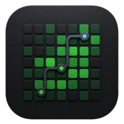
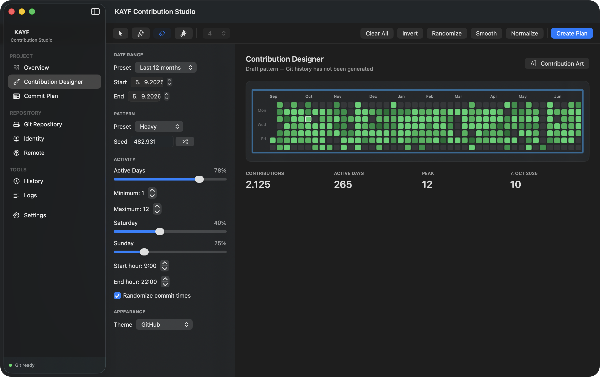

<div align="center">
  

  # KAYF Contribution Studio

  **A native macOS workspace for designing intentional GitHub contribution patterns.**

  [](https://www.apple.com/macos/)
  [](https://www.swift.org/)
  [](https://github.com/vKAYFv/KAYF-Contribution-Studio/actions/workflows/release.yml)

  [Download the latest release](https://github.com/vKAYFv/KAYF-Contribution-Studio/releases/latest) · [Changelog](CHANGELOG.md)
</div>



KAYF Contribution Studio turns text, symbols, and freehand pixel art into a deterministic contribution plan. It previews the result before touching Git, explains every generated commit, and keeps all repository operations explicit.

## Highlights

- **Contribution Designer** — draw directly on a GitHub-style calendar or render text and symbols into the grid.
- **Deterministic planning** — the same design and settings always produce the same dated commit plan.
- **Dry Run first** — inspect dates, commit counts, messages, and commands before generation.
- **Repository-aware workflow** — choose or create a repository, inspect its state, then generate locally.
- **Controlled publishing** — pushing is a separate, deliberate action with visible progress and errors.
- **Native macOS experience** — built with SwiftUI and AppKit, including keyboard shortcuts and system dialogs.

## Safety model

The app is designed around a few strict rules:

1. Preview and generation are separate operations.
2. Existing repositories must pass validation and use a dedicated generated branch.
3. Git commands are executed as argument arrays, not interpolated shell strings.
4. Every generated commit is reproducible from the plan.
5. Remote pushes only happen after an explicit user action.

## Typical workflow

```text
Design → Preview → Dry Run → Generate locally → Review → Push
```

Create a design, choose its date range and intensity, review the exact plan, then generate the repository. The final push remains optional.

## Requirements

- macOS 15.0 or later
- Xcode 16 or later for development
- Git available on `PATH`
- A GitHub account only when you want to push generated history

## Install a release

1. Download the `.dmg` from [GitHub Releases](https://github.com/vKAYFv/KAYF-Contribution-Studio/releases/latest).
2. Open the disk image.
3. Drag **KAYF Contribution Studio** into **Applications**.
4. Launch it from Applications or Spotlight.

Official release images are expected to be signed with a Developer ID certificate and notarized by Apple.

## Build from source

Open `KAYFContributionStudio.xcodeproj` in Xcode and run the `KAYFContributionStudio` scheme, or build from Terminal:

```bash
xcodebuild \
  -project KAYFContributionStudio.xcodeproj \
  -scheme KAYFContributionStudio \
  -configuration Release \
  -destination 'generic/platform=macOS' \
  CODE_SIGNING_ALLOWED=NO \
  build
```

## Create a DMG locally

The release helper builds the app, creates a compressed disk image, and writes a SHA-256 checksum:

```bash
scripts/build-dmg.sh 1.0.0
```

Artifacts are written to `dist/`:

```text
dist/KAYF-Contribution-Studio-1.0.0.dmg
dist/KAYF-Contribution-Studio-1.0.0.dmg.sha256
```

Without signing variables, the script uses an ad-hoc signature. That build is suitable for local testing, but not for a public macOS release.

### Signed and notarized DMG

First, save App Store Connect credentials in your keychain:

```bash
xcrun notarytool store-credentials "kayf-notary" \
  --apple-id "you@example.com" \
  --team-id "YOUR_TEAM_ID" \
  --password "YOUR_APP_SPECIFIC_PASSWORD"
```

Then build with your Developer ID Application identity:

```bash
SIGN_IDENTITY="Developer ID Application: Your Name (YOUR_TEAM_ID)" \
NOTARY_PROFILE="kayf-notary" \
scripts/build-dmg.sh 1.0.0
```

The script signs the app and DMG, submits the DMG to Apple, staples the notarization ticket, and validates the result.

## Publish a GitHub release

### Automated release

The workflow in `.github/workflows/release.yml` builds, signs, notarizes, and publishes every tag matching `v*`.

Add these repository secrets in **Settings → Secrets and variables → Actions**:

| Secret | Value |
| --- | --- |
| `MACOS_CERTIFICATE` | Base64-encoded Developer ID Application `.p12` |
| `MACOS_CERTIFICATE_PASSWORD` | Password used when exporting the `.p12` |
| `MACOS_SIGN_IDENTITY` | Full `Developer ID Application: … (TEAM_ID)` identity |
| `KEYCHAIN_PASSWORD` | A strong temporary CI keychain password |
| `APPLE_ID` | Apple Developer account email |
| `APPLE_TEAM_ID` | Apple Developer Team ID |
| `APPLE_APP_SPECIFIC_PASSWORD` | App-specific password for notarization |

Create and push a release tag:

```bash
git tag -a v1.0.0 -m "Release 1.0.0"
git push origin main
git push origin v1.0.0
```

GitHub Actions will attach the notarized `.dmg` and checksum to a new release and generate release notes.

### Publish from this Mac

With `gh` authenticated and signing configured, the local helper performs the build, tagging, push, and release creation:

```bash
gh auth login -h github.com

SIGN_IDENTITY="Developer ID Application: Your Name (YOUR_TEAM_ID)" \
NOTARY_PROFILE="kayf-notary" \
scripts/publish-release.sh v1.0.0
```

For an intentionally unsigned test release, opt in explicitly with `ALLOW_UNSIGNED_RELEASE=1`; the helper marks it as a GitHub prerelease.

## Tests

```bash
xcodebuild \
  -project KAYFContributionStudio.xcodeproj \
  -scheme KAYFContributionStudio \
  -destination 'platform=macOS' \
  CODE_SIGNING_ALLOWED=NO \
  test
```

The test suite covers deterministic planning, date mapping, safe command construction, repository validation, generation, and cancellation behavior.

## Architecture

```text
KAYFContributionStudio/
├── App/             App lifecycle, commands, and keyboard shortcuts
├── Models/          Project, calendar, plan, Git, and history values
├── Services/        Planning, Git execution, generation, and persistence
├── Features/        Designer, repository, history, and settings screens
└── Components/      Reusable visual components and heatmap
```

The UI is built with SwiftUI. Git integration stays behind small infrastructure boundaries, while planning logic remains independent and unit-testable.

## Generated repository footprint

Generated content is kept under `.kayf-contribution/`. Credentials and tokens are never written into generated repositories.

## Contributing

Issues and focused pull requests are welcome. Please keep Git operations explicit, preserve deterministic behavior, and include tests for planner or repository changes.

## License

No open-source license has been selected yet. Until one is added, all rights are reserved by the repository owner.
